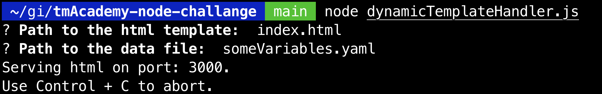
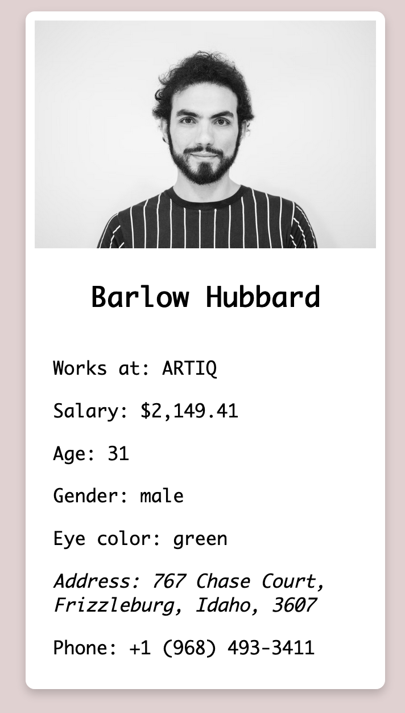

# TechMagic Academy - Node.js basic dynamic template handler

## Table of contents

- [Overview](#overview)
  - [The challenge](#project-requirements)
  - [How to use it](#how-to-use-it)
- [My process](#my-process)
  - [Built with](#built-with)
  - [Resource](#resources)

## Overview

### The challenge

Using Node.js create a basic dynamic template handler. That means the possibility to insert dynamic data into static HTML templates. When the app starts it should ask for the path to the HTML template file and to the data file.

If both are found - the user should be able to see the result on https://localhost:3000

HTML template example:

```
<div class="example">{{exampleVariable}}</div>
```

### Project Requirements

- [x] The app should ask the path to the template and to the data files via console.
- [x] Template file should be HTML, data file should be JSON or YAML.
- [x] Don't use data bases.
- [x] Basic error reporting.
- [x] Don't use the provided template, create your own one

### How to use it

To insert dynamic data into static HTML enclose the variable present in JSON or YAML file in dollar sign `$` and parentheses `$(variable)`

If the variable was not present in file it will render as template literal

Run the program with node and provide paths for HTML and files via the console

```
node dynamicTemplateHandler.js
```

If everything is correct it will log a message
` Serving html on port: 3000`



#### Demo

To see the script in action use the provided template in repository `index.html` and data file `someVariables.json` or `someVariables.yaml` you will be able to see small person info card



## My process

### Built with

- [Node.js](https://nodejs.org/)
- [Inquirer](https://www.npmjs.com/package/inquirer)
- [JS-YAML](https://www.npmjs.com/package/js-yaml)

### Resources

1. [How to serve static files | Node.js](https://nodejs.org/en/knowledge/HTTP/servers/how-to-serve-static-files/)
2. [File system | Node.js v18.4.0 Documentation](https://nodejs.org/api/fs.html)
3. [HTTP | Node.js v18.4.0 Documentation](https://nodejs.org/api/http.html)
4. [Accept input from the command line in Node.js](https://nodejs.dev/learn/accept-input-from-the-command-line-in-nodejs)
5. [5-Minute Node.js CLI Project - Fireship.io](https://www.youtube.com/watch?v=_oHByo8tiEY)
6. [Serve an HTML page using Node.js](https://flaviocopes.com/node-serve-html-page/)
